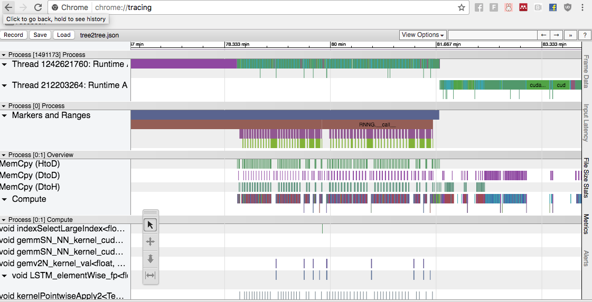

# nvprof2json



Converter of nvvp profiler output (SQLite3 databases) to
Google Trace Event Format, for use with about:tracing.
Inspired by Andrew Tulloch and Nicolas Vasilache's gnvprof

Documents:
* https://stackoverflow.com/questions/26145167/how-can-i-obtain-timing-values-from-the-output-of-nvprof-or-of-nvidia-visual-pro
* Trace Event Format https://docs.google.com/document/d/1CvAClvFfyA5R-PhYUmn5OOQtYMH4h6I0nSsKchNAySU/preview

Tested with CUDA 8.0.

## How to use

```
nvprof -o foo.nvvp your_program
nvprof2json foo.nvvp > foo.json
# Open foo.json in chrome://tracing
```

## Known bugs

* Times are inflated by x1000, since nvprof records at ns precision,
  while Google Trace Event viewer takes ms precision.  You can modify
  `munge_time` to divide by 1000 but this will cause the viewer to
  render less precisely.

## How to help

* The SQLite database contains a lot of undocumented information which
  we haven't put into the Google Trace Event format, but in principle
  could.  If you have some info you need, look at some of the sample
  database row outputs and see which has the information you're looking
  for.

* This Python script isn't written particularly efficiently.  Could be
  made much faster!

* The JSON output can become quite big.  Does chrome://tracing support
  a binary format?  If so, we should use that.
